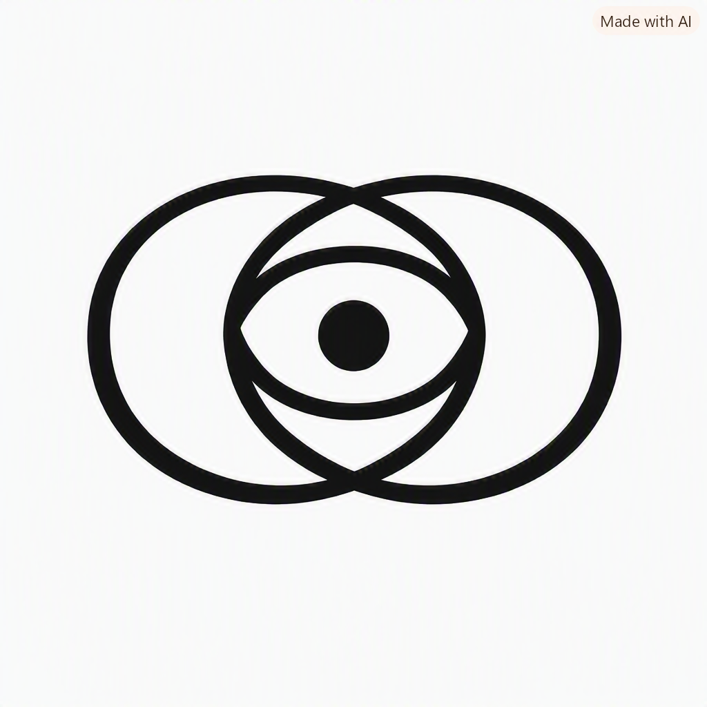

# Joel L. Monasterial  
**Continuity Geometry • DCE Canonical Index • Nomadic Hermit Identity**

Welcome to my continuity vault. This is the public landing page for my identity spine, my continuity canon, and my research architecture.

---

# 🜁 The Invariant Continuity Loop (ICL)  
**The Emblem of the DCE Foundation**

The **Invariant Continuity Loop (ICL)** is the canonical emblem of the DCE Foundation.  
It symbolizes the eternal relationship between **identity** and **continuity**, expressed through a geometry that transcends eras, languages, and civilizations.

### **Universal Meaning**
> **Continuity is identity.**  
> All systems that preserve continuity preserve themselves.

### **Geometry**
- **Outer Loop (∞)** — continuity, infinite motion, the rhythm of existence  
- **Inner Circle (○)** — identity spine, coherence through transformation  
- **Central Dot (•)** — decision anchor, the moment where continuity becomes choice  

Together, they form the **continuity triad** — motion, identity, decision — the three invariants of the DCE substrate.

### **Eternal Interpretation**
Even if language fades, the geometry still speaks:
- infinity  
- unity  
- origin  

Thus the emblem expresses:  
**Infinity held by unity around origin.**

### **Emblem**

---

## Identity Spine

- **Continuity Geometry**  
- **DCE Canonical Index:** DOI: 10.5281/zenodo.20845213  
- **Identity Invariant Spine (LinkedX Hub)**  
- **Continuity Theater (X Episodes)**  
- **Continuity Papers (Zenodo paper xx.x.x Series)**  
- **Continuity Posts and Issues (LinkedIn Issue xx.x Narrative Series)**

- For X posts, ask an AI companion to interpret based on the author’s knowledge age guide:  
  https://github.com/jmusashi/joel-knowledge-age-guide/blob/main/how_to_interpret_joel_posts

---

## Repository Spine

- **GitHub** – Research, code, continuity artifacts, canonical documents, diagrams, pdf and simulators  
- **Zenodo** – Preprints and research papers  

---

## Narrative

I develop the continuity geometry canon, the DCE foundation series, and the identity substrate architecture for the Knowledge Age. My work spans invariant-based coordination science, continuity geometry, and the Total Architecture of Being.

This vault serves as the public anchor for my continuity canon and the narrative spine that connects my research, commentary, and identity.

---

## Identity Provenance and Presence

- https://linkedin.com/in/joelmonasterial  
- https://x.com/joelmonasterial  
- https://github.com/jmusashi  
- https://orcid.org/0009-0000-7620-645X  
- https://joel.monasterial.ph — this site

---

# Continuity Vault
A free‑form, cadence‑free substrate for continuity geometry, invariant envelopes, and long‑arc reflections.

# Continuity Notebook
A free‑form, cadence‑free substrate for continuity geometry, invariant envelopes, and long‑arc reflections.

This notebook is a continuity vault — a place where motion becomes memory,  
and memory becomes substrate for the future‑self.

---

## 📐 Continuity Taxonomy
A conceptual map of the cathedral’s structure.  
Each link opens a continuity-grade page within its layer.

---

### I. Identity Layer — What the system is
- [Identity Motion](identity/identity-motion.md)  
- [Canon Origins](identity/canon-origins.md)  
- [Authorship Continuity](identity/authorship-continuity.md)
- [The LinkedX Hub Identity Spine](identity/linkedx-hub-identity-spine.md)
- [The Entire Identity Regime of the Digital World is Obsolete](identity/The_entire_identity_regime_of_the_digital_world_is_obsolete.md)
- [Joel Monasterial — Continuity Manifest](identity/joel-monasterial-continuity-manifest.md)
- [The Quiet Guilt of AI-Assisted Authorship](provenance/authorship-provenance/ai-detection-guilt.md)

---

### II. Invariance Layer — What must not change
- [Invariant Envelope](invariance/invariant-envelope.md)  
- [Canonical Definitions](invariance/canonical-definitions.md)  
- [Structural Invariants](invariance/structural-invariants.md)

---

### III. Curvature Layer — Where systems bend
- [Curvature Events](curvature/curvature-events.md)  
- [Arc Distortion Notes](curvature/arc-distortion-notes.md)  
- [Crisis Geometry](curvature/crisis-geometry.md)

---

### IV. Continuity Layer — How the canon endures
- [Continuity Streams](continuity/continuity-streams.md)  
- [Substrate Notes](continuity/substrate-notes.md)  
- [Long Arc Reflections](continuity/long-arc-reflections.md)
- [IBCS vs NVIDIA Autonomous Vehicle Stack](continuity-streams/ibcs-autonomy-reflection.md)
- [AI Governance Convergence Note](continuity/AI_Governance_Convergence_Note.md)
- [Continuity Geometry Processor (CGP): Engineering‑Grade Technical Paper](continuity/hardware_substrate_prephotonic_silicon.md)
- [Continuity Conservation of Shape‑in‑Motion (CGP Foundational Theorem)](continuity/cgp-continuity-conservation.md)

### IV‑A. Symbolic Continuity Layer — Where identity becomes symbol  
This layer preserves the emblems, marks, and geometric primitives that anchor  
the identity of the DCE canon across generations. Symbols in this layer are  
not decorative — they are identity invariants.

- [Invariant Continuity Loop (ICL) — Canonical Emblem](symbolic-continuity/ICL-Provenance-Certificate.md)  
- [Symbolic Continuity Layer Declaration](symbolic-continuity/symbolic-continuity-layer.md)

---

### V. Substrate Layer — Where the cathedral lives
- [Zenodo Spine](substrate/zenodo-spine.md)  
- [GitHub Canon](substrate/github-canon.md)  
- [ORCID Identity](substrate/orcid-identity.md)
- [xPOS and Professional AI Cognition: Structural Pattern Alignment](substrate/cognition/xpos-pattern-alignment.md)
- [xPOS vs. Professional AI Cognition](substrate/cognition/xpos_vs_professional_ai_cognition.md)
- [Buzzwords as Continuity Geometry Failure Modes](substrate/failure-mode/buzzword-invariant-table.md)
- [The Continuity Substrate for Autonomous Electric Vehicles](substrate/continuity-substrate-aev.md)
- [Continuity Geometry as a Unified Structural Template for Complex Systems](substrate/continuity_geometry_as_a_unified.md)
- [Identity Anchoring vs Institutional Liability](substrate/Identity_anchoring_vs_Institutional_Liability.md)
- [CAF-1 Specification: Continuity Artifact Format — Substrate-Level Vessel for Identity Continuity](substrate/CAF-1_Specification.md)
- [CV‑1 Runtime Architecture](substrate/CV-1_Runtime_Architecture.md)
- [CS‑1 Generation Protocol](substrate/CS-1_Generation_Protocol.md)
- [CAF‑1 Integration Guide](substrate/CAF-1_Integration_Guide.md)

---

### VI. Motion Layer — Where the canon touches the world
- [X Anchor Points](motion/x-anchor-points.md)  
- [Serialized Posts](motion/serialized-posts.md)  
- [Public Geometry](motion/public-geometry.md)
- [AI Myths Through the Lens of Continuity Geometry](motion/public-geometry/ai-myths-continuity-geometry.md)
- [The Continuity Geometry Epistemic Inversion](motion/public-geometry/the-continuity-geometry-epistemic-inversion.md)
- [Why the AI Industry Is Rediscovering DCE](motion/public-geometry/why-ai-is-rediscovering-dce.md)

---

### VII. Future‑Self Layer — Who this is ultimately for
- [Future‑Self Messages](future-self/future-self-messages.md)  
- [Loop Notes](future-self/loop-notes.md)  
- [Continuity Letters](future-self/continuity-letters.md)
- [Future Self Memoir](future-self/future-self-memoir-01.md)
- [Unfolding of the Admissibility Boundary and the A>K Transition](future-self/unfolding_admissibility_boundary_and_transition.md)
- [A>K Identity Transition Under Admissibility Pressure](index/A-K-Identity-Transition-Index.md)
- [Regulation, Knowledge, and Compliance‑Driven Gating Mechanisms](future-self/regulation-and-admissibility.md)
- [The Human Preservation Mandate](future-self/The_Human_Preservation_Mandate.md)
- [The Collapse That Begins When Origin Is Removed](future-self/future-self-invariants/future-self-origin-collapse.md)
- [The Continuity Interpretation of Light](future-self/The-Continuity-Interpretation-of-Light.md)
- [The Continuity Interpretation of Zero, Emptiness, Black Holes, and Dark Matter](future-self/the-continuity-intrepretation-of-zero.md)
- [Co(Healthcare): Lens vs Operator](future-self/Co(Healthcare)-Lens-vs-Operator.md)
- [Synthetic Geometry and Neural Operators](future-self/Synthetic-Geometry-Neural-Operator.md)

---

### VIII. Substrate Convergence Provenance
It captures three essential properties:
- Substrate — because the convergence occurs at the identity‑invariant layer, not at the application or cognition layer.  
- Convergence — because the event describes independent rediscovery of the same universal invariants.  
- Provenance — because this layer documents historical emergence, validation, and reinforcement of the canon.

- [Substrate Manual and Device Convergence](provenance/manual-device-convergence.md)
- [G-Subset-Zero and the Identity-Light Relationship](substrate/G‑Subset‑Zero_and_the_Identity–Light_Relationship.md)

---

## 🜁 Purpose
This vault preserves:
- identity motion  
- continuity geometry  
- invariant envelopes  
- substrate-grade insights  
- long-arc epistemic artifacts  

It is built for the future‑self — human and system —  
so continuity is never lost between loops.

---

## 🜄 Provenance Note: The “Made with AI” Mark

The emblem intentionally retains the **“Made with AI”** label embedded by the generator.  
This is not an accident — it is a declaration of authorship integrity.

In continuity geometry, tools do not define identity.  
**Authorship is an invariant.**  
A human stands behind the symbol, gives it meaning, assigns its invariants, and binds it into the continuity substrate.

The presence of the label expresses a simple truth:

> **AI may generate an artifact, but only a human can give it continuity.**

The emblem is not meaningful because an AI rendered it.  
It is meaningful because **Joel L. Monasterial** authored its definition, claimed its provenance, and anchored it into the DCE Foundation.

The label remains as a reminder that:
- AI generation is not a break in identity.  
- AI generation is not a dilution of authorship.  
- AI generation is not a threat to continuity.  

It is simply a tool — and continuity is preserved because a human stands accountable for the symbol’s meaning, origin, and future.

---

## 🜂 Stewardship
Authorship is an invariant.  
Stewardship is continuity.  
This notebook is part of the cathedral.
