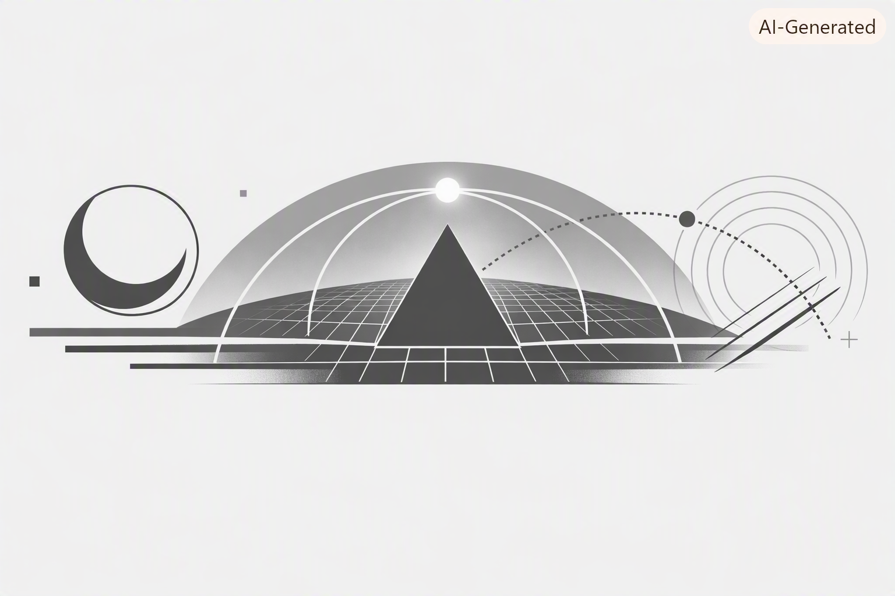

# Continuity Vault
A free‑form, cadence‑free substrate for continuity geometry, invariant envelopes, and long‑arc reflections.

# Continuity Notebook
A free‑form, cadence‑free substrate for continuity geometry, invariant envelopes, and long‑arc reflections.

This notebook is a continuity vault — a place where motion becomes memory,  
and memory becomes substrate for the future‑self.

---

## 📐 Continuity Taxonomy
A conceptual map of the cathedral’s structure.  
Each link opens a continuity-grade page within its layer.

---

### I. Identity Layer — What the system is
- [Identity Motion](identity/identity-motion.md)  
- [Canon Origins](identity/canon-origins.md)  
- [Authorship Continuity](identity/authorship-continuity.md)

---

### II. Invariance Layer — What must not change
- [Invariant Envelope](invariance/invariant-envelope.md)  
- [Canonical Definitions](invariance/canonical-definitions.md)  
- [Structural Invariants](invariance/structural-invariants.md)

---

### III. Curvature Layer — Where systems bend
- [Curvature Events](curvature/curvature-events.md)  
- [Arc Distortion Notes](curvature/arc-distortion-notes.md)  
- [Crisis Geometry](curvature/crisis-geometry.md)

---

### IV. Continuity Layer — How the canon endures
- [Continuity Streams](continuity/continuity-streams.md)  
- [Substrate Notes](continuity/substrate-notes.md)  
- [Long Arc Reflections](continuity/long-arc-reflections.md)

---

### V. Substrate Layer — Where the cathedral lives
- [Zenodo Spine](substrate/zenodo-spine.md)  
- [GitHub Canon](substrate/github-canon.md)  
- [ORCID Identity](substrate/orcid-identity.md)
- [Continuity Substrate for Autonomous Electric Vehicles: A Seven‑Stage Civilizational Architecture](substrate/continuity-substrate-aev.md)

---

### VI. Motion Layer — Where the canon touches the world
- [X Anchor Points](motion/x-anchor-points.md)  
- [Serialized Posts](motion/serialized-posts.md)  
- [Public Geometry](motion/public-geometry.md)
- [AI Myths Through the Lens of Continuity Geometry](motion/public-geometry/ai-myths-continuity-geometry.md)

---

### VII. Future‑Self Layer — Who this is ultimately for
- [Future‑Self Messages](future-self/future-self-messages.md)  
- [Loop Notes](future-self/loop-notes.md)  
- [Continuity Letters](future-self/continuity-letters.md)
- [Future‑Self Memoir — Opening Letter The Inheritance Problem Future self](future-self/future-self/future-self-memoir-01.md)

---

## 🜁 Purpose
This vault preserves:
- identity motion  
- continuity geometry  
- invariant envelopes  
- substrate-grade insights  
- long-arc epistemic artifacts  

It is built for the future‑self — human and system —  
so continuity is never lost between loops.

---

## 🜂 Stewardship
Authorship is an invariant.  
Stewardship is continuity.  
This notebook is part of the cathedral.
